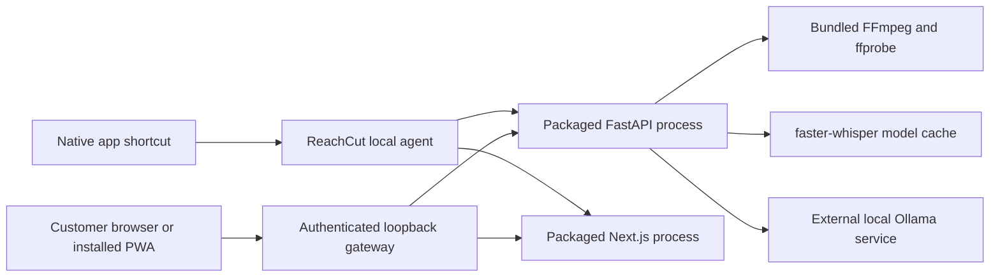
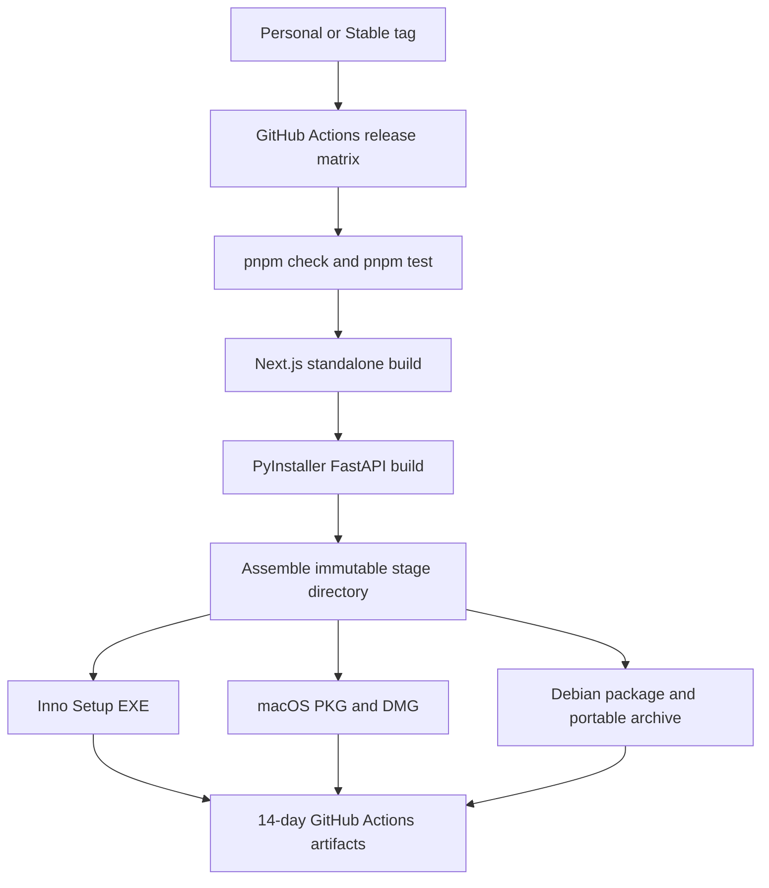

# ReachCut release system handbook

This is the technical source of truth for the native ReachCut release system on the
`release-bundle` branch. It explains the architecture, every release-related source file,
the build and runtime flows, Personal and Stable channels, installation behavior, release
commands, validation, and the work still required before customer distribution.

The release record in this handbook describes commit `f91eb7d` and internal build
`personal-v0.1.6` from 2026-10-09. That build's packaging jobs passed, but macOS testing
later found non-portable absolute symbolic links in both Python and Next.js. Do not use or
distribute its macOS or Linux artifacts. Update this document whenever the release
architecture, installer layout, profiles, CI workflow, or customer procedure changes.

## 1. Current release status

The release system can build native, self-contained application installers for four
targets:

| Target              | Native output                 | `personal-v0.1.6` status                          |
| ------------------- | ----------------------------- | ------------------------------------------------- |
| Windows x64         | Inno Setup `.exe`             | Built; installed-runtime smoke test was absent    |
| macOS Apple Silicon | `.pkg` and `.dmg`             | Rejected: absolute staged links                   |
| macOS Intel         | `.pkg` and `.dmg`             | Rejected: Python and Next.js cannot start         |
| Ubuntu/Debian x64   | `.deb` and portable `.tar.gz` | Rejected pending rebuild; same POSIX staging path |

The packaging-only `personal-v0.1.6` workflow is:

<https://github.com/shayaanahmed/reachcut/actions/runs/37910408826>

Those artifacts are **superseded unsigned internal-test builds**. They are not ready to be
presented as customer releases. Code signing, Apple notarization, release publication,
automatic updates, rollback, and customer clean-machine testing remain release gates.

The code currently lives on `release-bundle`. The repository's default branch is `main`
(locally it is also available as `master`/`origin/main` at the same older commit). The
intended promotion model is:

1. Develop and test release work on `release-bundle`.
2. Build a `personal-v*` tag from `release-bundle`.
3. Install and use that Personal build without affecting Stable customer data.
4. Open a pull request from `release-bundle` to `main`.
5. Merge only after the release candidate passes its gates.
6. Create a normal `v*` tag from the merged `main` commit to build Stable.

## 2. What the installed product is

ReachCut is not Electron and does not require Docker on the customer machine. It uses a
browser as its UI shell while shipping the application runtime as native files.



The installer bundles:

- the FastAPI application and Python dependencies as a PyInstaller `onedir` application;
- the Next.js standalone production server and its static/public files;
- a pinned private Node.js runtime;
- the ReachCut supervisor and authenticated gateway;
- FFmpeg and ffprobe executables;
- native launchers and background-start integration for the target OS;
- a generated `reachcut-package.json` runtime manifest.

It does not bundle:

- Docker;
- Ollama;
- Qwen weights;
- Whisper weights;
- a Python installation for the customer;
- Node.js or pnpm as a customer prerequisite;
- signing credentials or license keys.

## 3. Why the browser URL has a domain name

Stable opens:

```text
http://studio.reachcut.localhost:47321
```

Personal opens:

```text
http://studio.personal.reachcut.localhost:47331
```

The `.localhost` suffix is reserved for the local computer. The agent binds the gateway,
API, and web processes only to `127.0.0.1`. No DNS account, hosts-file modification,
public domain, TLS certificate, or internet connection is needed to resolve the UI name.
The hostname is branding and origin isolation; it does not make the service public.

## 4. Personal and Stable isolation

Both channels are built from the same code but have separate application identities,
ports, cookies, services, installation paths, and mutable data.

| Setting                     | Personal                             | Stable                      |
| --------------------------- | ------------------------------------ | --------------------------- |
| Display name                | ReachCut Personal                    | ReachCut                    |
| Tag pattern                 | `personal-vX.Y.Z`                    | `vX.Y.Z`                    |
| Artifact stem               | `ReachCut-Personal`                  | `ReachCut`                  |
| Browser hostname            | `studio.personal.reachcut.localhost` | `studio.reachcut.localhost` |
| Gateway port                | `47331`                              | `47321`                     |
| Internal API port           | `48110`                              | `48100`                     |
| Internal web port           | `48111`                              | `48101`                     |
| macOS bundle/package ID     | `com.reachcut.personal`              | `com.reachcut.desktop`      |
| macOS agent ID              | `com.reachcut.personal.agent`        | `com.reachcut.agent`        |
| Linux slug/package          | `reachcut-personal`                  | `reachcut`                  |
| Desktop data directory name | `ReachCut Personal`                  | `ReachCut`                  |
| Linux data directory name   | `reachcut-personal`                  | `reachcut`                  |

The Windows channels also use different fixed Inno Setup application GUIDs. Never change
an existing channel's ID after distribution: the ID is how the operating system recognizes
an upgrade rather than an unrelated product.

Ollama is intentionally shared at machine level. Its model storage is controlled by
Ollama, not by the ReachCut channel. The ReachCut databases, projects, exports, browser
sessions, ports, and Hugging Face caches remain isolated.

### Runtime data locations

| Platform | Personal                                                                 | Stable                                                 |
| -------- | ------------------------------------------------------------------------ | ------------------------------------------------------ |
| Windows  | `%LOCALAPPDATA%\ReachCut Personal`                                       | `%LOCALAPPDATA%\ReachCut`                              |
| macOS    | `~/Library/Application Support/ReachCut Personal`                        | `~/Library/Application Support/ReachCut`               |
| Linux    | `$XDG_DATA_HOME/reachcut-personal` or `~/.local/share/reachcut-personal` | `$XDG_DATA_HOME/reachcut` or `~/.local/share/reachcut` |

Each root contains `clipper.db` and application data. Packaged faster-whisper/Hugging Face
downloads use `cache/huggingface` beneath that root. Normal uninstallers leave mutable
customer data in place.

## 5. End-to-end build flow



The detailed sequence is:

1. GitHub checks out the exact tag commit on a native runner.
2. CI installs pinned pnpm, Node.js, uv, and Python versions.
3. `pnpm install --frozen-lockfile` reconstructs JavaScript dependencies.
4. `pnpm check` runs linting, formatting checks, and type checking.
5. `pnpm test` runs agent/gateway, profile, linked-directory copier, API, and web tests.
6. Windows CI installs Inno Setup.
7. The tag or manual input is converted into a semantic version and channel.
8. `packaging/build-release.mjs` builds Next.js.
9. The same script invokes PyInstaller `6.16.0` through uv.
10. `packaging/build-stage.mjs` creates one immutable payload tree, preserving POSIX links
    verbatim and rejecting absolute, escaping, or broken links.
11. The platform-specific builder wraps that stage into native installers.
12. CI installs the EXE, PKG, or DEB on its native runner and starts the installed API and
    web runtimes; Linux also starts the extracted portable archive and macOS verifies the
    DMG.
13. GitHub uploads the resulting files as workflow artifacts for 14 days only if those
    installed-runtime smoke tests pass.

The workflow does not currently create a GitHub Release. This is deliberate while the
artifacts are unsigned.

## 6. Generated stage layout

The stage is created at `build/stage` for Stable or `build/stage-personal` for Personal.
It is generated output and is ignored by Git.

```text
stage[-personal]/
├── api/
│   ├── reachcut-api[.exe]
│   └── _internal/...
├── bin/
│   ├── ffmpeg[.exe]
│   └── ffprobe[.exe]
├── runtime/
│   └── node[.exe]
├── scripts/
│   ├── reachcut-agent.mjs
│   └── reachcut-agent-lib.mjs
├── web/
│   ├── apps/web/server.js
│   ├── apps/web/.next/static/...
│   ├── apps/web/public/...
│   └── node_modules/...
├── LICENSE
└── reachcut-package.json
```

`reachcut-package.json` is generated per build. It records the product, channel, version,
platform, architecture, hostname, three ports, data-directory name, and the API/web
commands as executable-and-argument arrays. The agent expands `{rootDir}`, `{apiPort}`,
and other placeholders without evaluating a shell string.

All generated files live under `build/`:

| Path                      | Contents                                              |
| ------------------------- | ----------------------------------------------------- |
| `build/pyinstaller/`      | Packaged API output                                   |
| `build/pyinstaller-work/` | Temporary PyInstaller analysis/build files            |
| `build/stage`             | Stable staged application                             |
| `build/stage-personal`    | Personal staged application                           |
| `build/installers/`       | Native output files                                   |
| `build/ci-personal-*`     | Locally downloaded workflow artifacts, when requested |

## 7. Runtime and authentication flow

When the user opens ReachCut:

1. The OS launcher starts the bundled Node runtime with `reachcut-agent.mjs`.
2. The agent reads the package manifest and chooses the correct channel profile.
3. It creates/uses the channel's mutable data directory.
4. It generates three independent random secrets in memory:
   - an API token between the gateway and FastAPI;
   - a one-use browser bootstrap token;
   - a browser session token.
5. It starts FastAPI on the private API port.
6. It starts Next.js on the private web port.
7. It waits for both health checks.
8. It starts the public-named gateway on its loopback gateway port.
9. It opens a bootstrap URL whose token is in the URL fragment.
10. Gateway JavaScript removes the fragment from browser history and exchanges it once
    for an `HttpOnly`, `SameSite=Strict` cookie.
11. Authenticated `/api/*` traffic is streamed to FastAPI with the private API header.
12. Other authenticated traffic is streamed to Next.js.

Security controls include:

- exact `Host` validation;
- loopback-only binding;
- one-use, two-minute bootstrap credentials;
- constant-time secret comparison;
- mutation-origin checks;
- removal of browser-supplied internal-token and cookie headers before proxying;
- CSP, frame, content-type, referrer, permissions, and opener headers;
- API rejection of requests that bypass the gateway while agent mode is active;
- no shell-based subprocess execution;
- graceful child shutdown followed by a bounded force-stop.

## 8. First-run setup flow

The first dashboard request checks `/api/setup/status`. If the required local tools are not
ready, the setup assistant is shown.

1. FFmpeg and ffprobe are found on `PATH`; packaged runs prepend the bundled `bin/` folder.
2. ReachCut queries Ollama's local `/api/version` and `/api/tags` endpoints.
3. If Ollama is absent, the UI links to <https://ollama.com/download>.
4. ReachCut does not silently download or execute the third-party Ollama installer.
5. After Ollama is running, the user may explicitly request the configured Qwen model.
6. The API calls Ollama `/api/pull` with streaming disabled and a two-hour timeout.
7. The response and subsequent model inventory are verified.
8. faster-whisper downloads `large-v3-turbo` on the first analysis rather than during
   installation.

Important storage detail: Ollama owns its model storage. Qwen is not stored in the ReachCut
data directory. The packaged Hugging Face/Whisper cache is stored under ReachCut's channel
data directory. The current setup-page footer should eventually be made more precise about
this distinction.

## 9. Platform installation behavior

### Windows x64

Expected filename:

```text
ReachCut-Personal-X.Y.Z-windows-x64-setup.exe
ReachCut-X.Y.Z-windows-x64-setup.exe
```

Behavior:

- installs per user under `%LOCALAPPDATA%\Programs\<application name>`;
- requires no administrator privileges;
- creates a Start Menu shortcut;
- offers an optional desktop shortcut;
- enables a current-user Startup-folder background shortcut by default on first install;
- uses `wscript.exe` and VBScript launchers so no console window appears;
- uses the fixed channel AppId for upgrade/uninstall identity;
- removes program files and shortcuts on uninstall, but not user project data.

### macOS 13+ Apple Silicon and Intel

Expected filenames:

```text
ReachCut-Personal-X.Y.Z-macos-arm64.pkg
ReachCut-Personal-X.Y.Z-macos-arm64.dmg
ReachCut-Personal-X.Y.Z-macos-x86_64.pkg
ReachCut-Personal-X.Y.Z-macos-x86_64.dmg
```

Behavior:

- the PKG installs the app in `/Applications`;
- the PKG installs a system-wide LaunchAgent definition under `/Library/LaunchAgents`;
- the app bundle is an `LSUIElement` agent-style app and opens a browser rather than an
  embedded native window;
- the DMG supports drag-to-Applications installation;
- the DMG contains the app but does not install the LaunchAgent;
- uninstall is currently manual and user data remains in Application Support;
- customer distribution requires Developer ID signing, notarization, and stapling.

The PKG needs administrator authorization because it writes to `/Applications` and
`/Library/LaunchAgents`. The DMG app can normally be copied by the logged-in user, subject
to local permissions.

### Ubuntu/Debian x64

Expected filenames:

```text
ReachCut-Personal-X.Y.Z-linux-amd64.deb
ReachCut-Personal-X.Y.Z-linux-amd64-portable.tar.gz
ReachCut-X.Y.Z-linux-amd64.deb
ReachCut-X.Y.Z-linux-amd64-portable.tar.gz
```

Behavior:

- the Debian package installs immutable application files under `/opt/<channel slug>`;
- it adds `/usr/bin/<channel slug>`;
- it installs a desktop entry and the ReachCut SVG icon;
- it installs a systemd user service and globally enables that user unit;
- its pre-removal script disables the unit globally on package removal;
- the portable archive uses a launcher relative to the extracted folder;
- the portable archive does not register desktop or startup integration;
- mutable data remains in the user's XDG data directory after removal.

## 10. Complete release file inventory

This inventory is derived from `git diff --name-status origin/main...release-bundle`. “New”
means introduced by the release work; “Modified” means an existing application file was
changed to support release behavior.

### Repository, commands, dependencies, and automation

| File                                       | State    | Purpose and consumer                                                                                                                                                   |
| ------------------------------------------ | -------- | ---------------------------------------------------------------------------------------------------------------------------------------------------------------------- |
| `.env.example`                             | Modified | Documents branded gateway ports/hostname and the long Ollama pull timeout. Used as developer configuration guidance.                                                   |
| `.gitattributes`                           | New      | Forces LF text across CI platforms and marks installers/images as binary. This prevents Windows checkout encoding/newline differences from breaking source validation. |
| `.gitignore`                               | Modified | Ignores all generated `build/` stages, PyInstaller work, installers, and downloaded CI artifacts.                                                                      |
| `.github/workflows/release-installers.yml` | New      | Defines the four-platform native-runner matrix, version/channel resolution, validation, installer build/install/runtime smoke tests, and 14-day artifact upload.       |
| `README.md`                                | Modified | Adds local-agent use, branded URL, Personal/Stable build commands, installer outputs, and first-run setup summary.                                                     |
| `package.json`                             | Modified | Adds agent/build scripts, pins `pnpm@11.19.0`, includes static FFmpeg/ffprobe packages, and makes API checks/tests install dev extras.                                 |
| `pnpm-workspace.yaml`                      | Modified | Allows the aliased static ffprobe package's install/build behavior.                                                                                                    |
| `pnpm-lock.yaml`                           | Modified | Locks the new Node packaging dependencies and exact transitive graph. CI uses it with `--frozen-lockfile`.                                                             |
| `apps/api/pyproject.toml`                  | Modified | Pins ONNX Runtime and cryptography to versions with supported native wheels across the release matrix, including Intel macOS.                                          |
| `apps/api/uv.lock`                         | Modified | Locks the updated Python dependency graph and platform wheels used by CI and PyInstaller.                                                                              |

### Common build and packaging implementation

| File                                  | State | Purpose and consumer                                                                                                                                                            |
| ------------------------------------- | ----- | ------------------------------------------------------------------------------------------------------------------------------------------------------------------------------- |
| `packaging/release-profile.mjs`       | New   | Single source of truth for Personal and Stable names, IDs, slugs, ports, origins, and data-directory names. Imported by both release and staging scripts.                       |
| `packaging/release-profile.test.mjs`  | New   | Proves that Personal and Stable identities/ports are distinct and rejects unknown channels.                                                                                     |
| `packaging/build-release.mjs`         | New   | Top-level native build orchestrator. Validates semantic versions, builds Next.js, invokes PyInstaller, stages files, and dispatches to the current OS builder without a shell.  |
| `packaging/build-stage.mjs`           | New   | Creates the immutable stage, copies runtimes/assets, validates required outputs and portable links, and writes `reachcut-package.json`.                                         |
| `packaging/copy-directory.mjs`        | New   | Dereferences links and materializes pnpm's hoisted dependency view for Windows, preserves relative links on POSIX, and rejects unsafe staged links.                             |
| `packaging/copy-directory.test.mjs`   | New   | Regression tests for Windows dereferencing/module resolution and portable POSIX-link preservation/validation. Included in `pnpm test:agent` and therefore in `pnpm test`/CI.    |
| `packaging/smoke-installed.mjs`       | New   | CI smoke harness that starts the Node supervisor from an installed/extracted native package, waits for API/web/gateway readiness, redacts the bootstrap token, and shuts down.  |
| `packaging/runtime/api_entry.py`      | New   | Executable entry point for the packaged API. Starts uvicorn on loopback and also supports recursive `-m yt_dlp` calls used by URL imports.                                      |
| `packaging/runtime/reachcut-api.spec` | New   | PyInstaller recipe. Collects dynamic modules, native libraries, model metadata, and plugin data for clipper, AV, CTranslate2, OpenCV, faster-whisper, ONNX Runtime, and yt-dlp. |

### Supervisor and authenticated local gateway

| File                              | State | Purpose and consumer                                                                                                                                                                            |
| --------------------------------- | ----- | ----------------------------------------------------------------------------------------------------------------------------------------------------------------------------------------------- |
| `scripts/reachcut-agent.mjs`      | New   | Main supervisor. Loads configuration/manifest, resolves data paths, creates secrets, starts API/web children, waits for health, starts the gateway, opens the browser, and shuts children down. |
| `scripts/reachcut-agent-lib.mjs`  | New   | Pure gateway/configuration helpers: hostname/port/command validation, OS data paths, authentication, proxying, security headers, WebSocket upgrades, health polling, and tokens.                |
| `scripts/reachcut-agent.test.mjs` | New   | Tests configuration validation, OS paths, Host checks, bootstrap exchange, session enforcement, proxy security, origin checks, and private API-token injection.                                 |

### Windows package

| File                                      | State | Purpose and consumer                                                                                                                                                         |
| ----------------------------------------- | ----- | ---------------------------------------------------------------------------------------------------------------------------------------------------------------------------- |
| `packaging/windows/ReachCut.iss`          | New   | Inno Setup definition for per-user installation, shortcuts, optional desktop icon, default first-install autostart, compression, upgrade identity, and launch-after-install. |
| `packaging/windows/launch.vbs`            | New   | Starts the bundled agent invisibly and allows it to open/authorize the browser. Used by Start Menu and desktop shortcuts.                                                    |
| `packaging/windows/launch-background.vbs` | New   | Starts the agent invisibly with `--no-browser`. Used by the Startup-folder shortcut.                                                                                         |

### macOS package

| File                                       | State | Purpose and consumer                                                                                                                           |
| ------------------------------------------ | ----- | ---------------------------------------------------------------------------------------------------------------------------------------------- |
| `packaging/macos/build-installer.sh`       | New   | Builds the channel-specific `.app`, substitutes plist IDs/version/name, writes a LaunchAgent, creates the PKG, and creates the compressed DMG. |
| `packaging/macos/Info.plist`               | New   | App-bundle metadata template: name, identifier, executable, version, macOS 13 minimum, and background-agent UI mode.                           |
| `packaging/macos/ReachCut`                 | New   | App executable shell launcher. Resolves the bundle resource folder and execs the packaged Node agent in production mode.                       |
| `packaging/macos/com.reachcut.agent.plist` | New   | Active LaunchAgent template installed by the PKG. Starts the channel-specific agent at login with no browser.                                  |

### Linux package

| File                                     | State | Purpose and consumer                                                                                                                  |
| ---------------------------------------- | ----- | ------------------------------------------------------------------------------------------------------------------------------------- |
| `packaging/linux/build-installer.sh`     | New   | Creates the Debian filesystem/control metadata, substitutes channel names/paths, builds the `.deb`, and creates the portable archive. |
| `packaging/linux/reachcut`               | New   | Installed `/usr/bin` launcher for the Debian package. Starts the packaged agent and opens the browser.                                |
| `packaging/linux/reachcut-portable`      | New   | Relative-path launcher for an extracted portable archive.                                                                             |
| `packaging/linux/reachcut-agent.service` | New   | Active systemd user-service template. Runs the packaged agent at login with restart-on-failure and no browser.                        |
| `packaging/linux/reachcut.desktop`       | New   | Desktop-menu entry template with channel-specific display name, executable, and icon.                                                 |
| `packaging/linux/postinst`               | New   | Debian post-install script that globally enables the channel's systemd user service.                                                  |
| `packaging/linux/prerm`                  | New   | Debian pre-removal script that globally disables that service on removal.                                                             |

### Reference startup templates

These files were created during the architecture work but are not used by the finalized
native builders above. They are reference templates and should either be kept deliberately
or removed after the active package paths are fully settled.

| File                                             | State | Purpose                                                                                         |
| ------------------------------------------------ | ----- | ----------------------------------------------------------------------------------------------- |
| `packaging/local-agent/com.reachcut.agent.plist` | New   | Earlier generic macOS LaunchAgent template with install/log placeholders.                       |
| `packaging/local-agent/reachcut-agent.service`   | New   | Earlier generic Linux systemd user-service template.                                            |
| `packaging/local-agent/windows-task.xml`         | New   | Earlier Windows Scheduled Task design. Final Windows packaging uses the Startup folder instead. |

### API first-run setup and local-agent protection

| File                                     | State    | Purpose and consumer                                                                                                                    |
| ---------------------------------------- | -------- | --------------------------------------------------------------------------------------------------------------------------------------- |
| `apps/api/src/clipper/config.py`         | Modified | Adds the model-download timeout and secret local-agent token setting.                                                                   |
| `apps/api/src/clipper/main.py`           | Modified | Adds the branded origin to CORS and middleware that rejects direct API calls when an agent token is active.                             |
| `apps/api/src/clipper/api/routes.py`     | Modified | Registers the new setup router.                                                                                                         |
| `apps/api/src/clipper/api/schemas.py`    | Modified | Defines the typed setup-status response returned to the web client.                                                                     |
| `apps/api/src/clipper/api/setup.py`      | New      | Implements setup status and explicit editorial-model download endpoints. Checks bundled tools and maps Ollama errors to HTTP responses. |
| `apps/api/src/clipper/services/setup.py` | New      | Framework-independent Ollama status/pull service using the local HTTP API and explicit error types.                                     |
| `apps/api/tests/test_api.py`             | Modified | Adds direct-API token rejection and same-origin/CORS coverage for agent mode.                                                           |
| `apps/api/tests/test_architecture.py`    | Modified | Keeps architecture checks portable across Windows UTF-8 checkouts and continues enforcing no-shell subprocess use.                      |
| `apps/api/tests/test_config.py`          | Modified | Verifies the new model-download timeout configuration.                                                                                  |
| `apps/api/tests/test_setup.py`           | New      | Tests model discovery, explicit pull/verification, and missing-Ollama API status.                                                       |

### Web setup, branding, and same-origin transport

| File                                               | State    | Purpose and consumer                                                                                                                                |
| -------------------------------------------------- | -------- | --------------------------------------------------------------------------------------------------------------------------------------------------- |
| `apps/web/app/icon.svg`                            | New      | ReachCut application/PWA SVG icon; also installed as the Linux desktop icon.                                                                        |
| `apps/web/app/manifest.ts`                         | New      | Channel-aware PWA manifest with name, standalone display mode, colors, scope, and icon.                                                             |
| `apps/web/app/layout.tsx`                          | Modified | Displays Personal or Stable branding at build time, registers the manifest, and adds Setup navigation.                                              |
| `apps/web/app/page.tsx`                            | Modified | Replaces direct dashboard rendering with the first-run readiness gate.                                                                              |
| `apps/web/app/setup/page.tsx`                      | New      | Always-available setup/diagnostics route.                                                                                                           |
| `apps/web/app/styles.css`                          | Modified | Adds responsive styles for setup status, actions, warnings, and loading state.                                                                      |
| `apps/web/features/setup/api.ts`                   | New      | API client functions for setup status and model pull; all HTTP behavior stays outside components.                                                   |
| `apps/web/features/setup/setup-assistant.tsx`      | New      | Presents Ollama, editorial model, Whisper, and bundled-tool readiness and explicit setup actions.                                                   |
| `apps/web/features/setup/setup-gate.tsx`           | New      | Checks readiness before showing the dashboard and transitions to it once setup succeeds.                                                            |
| `apps/web/features/setup/setup-assistant.test.tsx` | New      | Tests model-download behavior and the official Ollama link/disabled state.                                                                          |
| `apps/web/lib/contracts.ts`                        | Modified | Adds Zod validation and the TypeScript type for setup responses.                                                                                    |
| `apps/web/lib/http.ts`                             | Modified | Makes uploads use the same `/api` origin by default, allowing the gateway to authenticate and stream them.                                          |
| `apps/web/lib/api.test.ts`                         | Modified | Updates transport tests for same-origin upload and URL-import requests.                                                                             |
| `apps/web/test/setup.ts`                           | New      | Runs Testing Library cleanup after every web test so React work cannot leak into the destroyed jsdom environment and make release validation flaky. |
| `apps/web/vitest.config.ts`                        | Modified | Loads the shared web-test setup file in every Vitest worker.                                                                                        |

`apps/web/next.config.ts` was not created by this release diff, but it is essential to the
release. Its `output: "standalone"` setting produces the deployable web tree, and its
rewrite sends `/api/*` to the private API origin supplied by the agent.

### Release documentation

| File                              | State | Purpose                                                                                                                                                                        |
| --------------------------------- | ----- | ------------------------------------------------------------------------------------------------------------------------------------------------------------------------------ |
| `docs/local-agent.md`             | New   | Detailed gateway architecture, authentication, configuration, PWA, and packaging contract.                                                                                     |
| `docs/installers.md`              | New   | Supported artifacts, bundled contents, channel isolation, OS behavior, signing needs, and release gates.                                                                       |
| `docs/commercial-release-plan.md` | New   | Original milestone plan for a commercial pilot. Parts still describe the earlier Docker/image direction and must not override this handbook's native-installer implementation. |
| `docs/release-system-handbook.md` | New   | This consolidated map of the implemented release system and operational procedure.                                                                                             |

## 11. Local build commands

Use the exact dependency versions recorded by the repository. From the repository root:

```bash
pnpm install --frozen-lockfile
pnpm check
pnpm test
```

Build Personal on the current operating system:

```bash
pnpm build:personal -- --version 0.1.6
```

Build Stable on the current operating system:

```bash
pnpm build:stable -- --version 0.1.0
```

Build only the stage for inspection:

```bash
pnpm build:stage -- --version 0.1.0 --channel personal
```

Important constraints:

- run build scripts through pnpm; `build-release.mjs` deliberately uses pnpm's resolved
  CLI path for portable Windows execution;
- one host builds only its own native target;
- Windows needs Inno Setup 6, unless `INNO_SETUP_COMPILER` points to `ISCC.exe`;
- macOS needs `pkgbuild` and `hdiutil`;
- Linux needs `dpkg-deb` and `tar`;
- version input must be exactly numeric semantic version form such as `0.1.6`;
- a clean build can download large Python/Node dependency sets.

Pinned CI tools are Node `24.11.1`, pnpm `11.19.0`, uv `0.12.5`, Python `3.13`, and
PyInstaller `6.16.0`.

## 12. Personal release procedure

Use Personal for private daily use and release qualification.

1. Work on `release-bundle`.
2. Run checks and tests.
3. Ensure the worktree is clean.
4. Commit and push `release-bundle`.
5. Choose a new version. Never reuse or move an existing release tag.
6. Create and push the Personal tag:

   ```bash
   git tag -a personal-v0.2.0 -m "ReachCut Personal 0.2.0"
   git push origin personal-v0.2.0
   ```

7. Monitor the four GitHub Actions jobs.
8. Download the artifact matching the test computer.
9. Record SHA-256 checksums.
10. Install it and run the smoke-test checklist below.
11. Use the Personal build for real work long enough to expose upgrade/runtime problems.

The obsolete `personal-v0.1.0` through `personal-v0.1.8` tags are historical CI attempts.
Do not reuse them. Although all four `personal-v0.1.6` packaging jobs passed, installed
macOS testing rejected that release because the staged symlinks pointed to the CI runner.
The new runtime gate rejected `0.1.7` for Windows module resolution and `0.1.8` for an
Intel-only cryptography/OpenSSL mismatch; neither failed artifact was uploaded.

## 13. Stable release procedure

Do not create a public Stable release yet. Once signing and the remaining gates exist:

1. Confirm the accepted Personal candidate commit.
2. Open a PR from `release-bundle` to `main`.
3. Require checks and human review.
4. Merge without adding unrelated changes.
5. Check out/update `main` and verify its commit SHA.
6. Run the full local validation again where practical.
7. Create an annotated Stable tag on that exact `main` commit:

   ```bash
   git tag -a v0.1.0 -m "ReachCut 0.1.0"
   git push origin v0.1.0
   ```

8. CI interprets `v0.1.0` as Stable and builds all four targets.
9. Signing/notarization jobs must sign and verify the outputs.
10. Generate and publish checksums, SBOMs, release notes, and compatibility information.
11. Create a draft GitHub Release, complete final smoke tests, then publish it.
12. Preserve the exact commit, tag, artifacts, checksums, and signing/notarization records.

Current CI stops after unsigned artifact upload, so steps 9–12 still need implementation.

## 14. Customer installation flow after release readiness

### Windows

1. Customer downloads the signed `windows-x64-setup.exe`.
2. Customer verifies the publisher signature.
3. Customer runs the installer as their normal user.
4. Customer keeps the default login-start option or disables it intentionally.
5. Installer launches ReachCut.
6. Browser opens the branded `.localhost` URL.
7. Setup checks Ollama and guides the model download.

### macOS

1. Customer downloads the notarized package appropriate to Apple Silicon or Intel.
2. Customer opens the PKG for full installation/startup integration, or uses the DMG when
   automatic login startup is not wanted.
3. macOS verifies Developer ID and notarization.
4. The PKG requests administrator authorization.
5. Customer opens ReachCut from Applications.
6. Browser opens the branded `.localhost` URL.
7. Setup checks Ollama and guides the model download.

### Linux

1. Customer downloads the signed/checksummed `.deb` for supported Ubuntu/Debian x64.
2. Customer verifies its checksum/signature.
3. Customer installs it with the system package manager.
4. Customer opens ReachCut from the desktop menu.
5. The systemd user service starts at subsequent graphical logins.
6. Portable users extract the archive and run its `reachcut` launcher manually.

## 15. Smoke-test checklist

Every candidate should be tested on a clean supported machine or VM.

- [ ] Installer identity, filename, version, and architecture are correct.
- [ ] Installer signature/notarization is valid for customer candidates.
- [ ] Fresh install succeeds without developer tools.
- [ ] Browser opens the correct channel hostname.
- [ ] Direct access to the private API port is rejected in agent mode.
- [ ] Setup correctly detects missing/running Ollama.
- [ ] Qwen model pull succeeds, resumes after interruption, and is detected afterward.
- [ ] First Whisper analysis downloads/caches its model successfully.
- [ ] Upload a representative local media file.
- [ ] Import an allowlisted authorized URL.
- [ ] Transcribe, analyze, preview, approve, and render a clip.
- [ ] Verify FFmpeg/ffprobe are the bundled versions.
- [ ] Restart the application and confirm the project remains.
- [ ] Reboot/login and test background startup plus browser authorization.
- [ ] Install the next version over the current version.
- [ ] Confirm data survives the upgrade.
- [ ] Uninstall application files.
- [ ] Confirm retained customer data is explained and recoverable.
- [ ] Confirm Personal and Stable run side by side without sharing state or ports.

## 16. Validation and diagnostic commands

Source validation:

```bash
pnpm check
pnpm test
```

Agent-only tests:

```bash
pnpm test:agent
```

Inspect repository release changes:

```bash
git diff --name-status origin/main...release-bundle
```

Inspect a downloaded artifact:

```bash
shasum -a 256 build/ci-personal-X.Y.Z/*
```

macOS internal checks:

```bash
pkgutil --check-signature path/to/ReachCut.pkg
hdiutil verify path/to/ReachCut.dmg
```

An unsigned PKG reports `Status: no signature`; that is expected only for internal builds.

## 17. Upgrade and uninstall model

There is no automatic updater yet. A newer native installer replaces application files for
the same channel because its package identity is stable. Mutable data is outside the
application directory and should survive replacement.

What is currently safe by design:

- Personal and Stable package identities do not collide;
- mutable data is outside immutable application files;
- installer output is deterministic in naming/profile behavior;
- native package managers own installed application files and OS integrations.

What is not yet guaranteed:

- database schema migration and rollback;
- an automatic pre-upgrade backup;
- atomic update recovery;
- rollback after a failed health check;
- compatibility testing from every supported prior version;
- customer-visible data removal during uninstall.

Until these exist, upgrades need an explicit backup and manual smoke test.

## 18. Known limitations and required follow-up

### Blocking customer-release gaps

- Windows artifacts are not Authenticode signed or timestamped.
- macOS app/PKG/DMG artifacts are not Developer ID signed, notarized, or stapled.
- Linux artifacts do not have published signed checksums or repository metadata.
- GitHub Actions does not create a release, SBOM, vulnerability report, or provenance.
- There is no automatic updater or rollback.
- There is no versioned database migration/backup gate.
- Hardware requirements have not been established by repeatable benchmark results.
- Machine licensing is not implemented.
- Clean-machine install/upgrade/uninstall qualification is incomplete.

### Superseded Personal 0.1.6 artifacts

Node's default recursive copy behavior rewrote relative PyInstaller and Next.js links as
absolute paths into the GitHub runner workspace. The macOS package therefore could not
load `_internal/Python` or `next` after installation. Linux used the same POSIX staging
path and is also rejected. The corrected copier preserves the original relative link text,
validates every staged link, and the workflow now starts the installed runtime before it
uploads artifacts.

### Background-start browser authorization

Background startup launches the agent with `--no-browser`. The agent's session secret is
regenerated on every start, invalidating the old browser cookie. If a user then launches a
second shortcut while the background agent is already running, the second process currently
opens the ordinary origin rather than obtaining a new one-time bootstrap URL from the
running process. On a fresh login this can show “authorization required.”

This must be fixed before relying on background auto-start for customers. Appropriate
solutions include a protected local activation IPC endpoint, OS-specific activation
handoff, or securely persisted/rekeyed browser authorization. Do not weaken the gateway by
removing authentication.

### Version consistency

The tag/build version is written into installer metadata and the generated package
manifest. Repository `package.json` and the FastAPI app declaration still contain static
`0.1.0` values. Before public releases, define whether those source versions are updated by
a release script or generated from one canonical version source.

### CI efficiency and action warnings

The current matrix repeats the complete validation suite on all four platforms. This is
useful during bootstrap but expensive. A future workflow can run one shared validation job
and make packaging jobs depend on it, while retaining platform-specific smoke tests.

GitHub currently warns that some third-party action versions target the deprecated Node 20
action runtime and are being forced onto Node 24. The jobs pass, but the actions should be
upgraded when compatible releases are available.

### Reference-template cleanup

`packaging/local-agent/` is not consumed by the current native builders. Keep it only if it
serves an intentional design-reference purpose; otherwise remove it to prevent maintainers
from editing the wrong startup definition.

## 19. How to change the release system safely

| Desired change                           | Primary files                                                                  | Required validation                                               |
| ---------------------------------------- | ------------------------------------------------------------------------------ | ----------------------------------------------------------------- |
| Rename a channel or change ports/IDs     | `packaging/release-profile.mjs` plus OS builders where profiles are duplicated | Profile tests, side-by-side install, upgrade identity review      |
| Change gateway security/session behavior | `scripts/reachcut-agent-lib.mjs`                                               | Full agent tests and browser/session smoke test                   |
| Change process supervision/data paths    | `scripts/reachcut-agent.mjs`                                                   | All agent tests, restart/termination tests, data persistence test |
| Add a Python dependency                  | `apps/api/pyproject.toml`, `apps/api/uv.lock`, PyInstaller spec if dynamic     | All four native builds and startup smoke tests                    |
| Add a Node/runtime dependency            | `package.json`, `pnpm-lock.yaml`, possibly workspace allow list                | Frozen install and all four native builds                         |
| Change bundled runtime layout            | `packaging/build-stage.mjs` and package manifest consumers                     | Stage inspection plus all platform installers                     |
| Change Windows installation              | `packaging/windows/*`                                                          | Fresh install, upgrade, autostart, uninstall on Windows           |
| Change macOS installation                | `packaging/macos/*`                                                            | ARM and Intel build, codesign/notary checks, PKG and DMG tests    |
| Change Linux installation                | `packaging/linux/*`                                                            | Debian install/upgrade/remove and portable test                   |
| Change first-run model setup             | API setup service/routes and web setup feature                                 | API/web tests, missing/running Ollama, interrupted pull           |
| Change release triggers/targets          | `.github/workflows/release-installers.yml`                                     | Personal tag dry run before Stable promotion                      |

Profile values are currently centralized in JavaScript for common staging, but the shell
builders also contain channel mappings. When a profile changes, search for the old value
across `packaging/`, workflow files, docs, tests, and UI copy to prevent drift.

## 20. Personal 0.1.6 release record

| Item            | Value                                                        |
| --------------- | ------------------------------------------------------------ |
| Source commit   | `f91eb7dcde67b74c7914c437b62c1573f66a5ac6`                   |
| Tag             | `personal-v0.1.6`                                            |
| Workflow run    | `37910408826`                                                |
| CI result       | All four packaging jobs passed                               |
| Runtime result  | Rejected after Intel macOS installation exposed broken links |
| Signing         | None; internal test only                                     |
| Artifact expiry | 2026-10-23                                                   |

GitHub artifact archive sizes:

| Artifact                        |       Bytes |
| ------------------------------- | ----------: |
| `reachcut-personal-Windows-X64` | 210,736,313 |
| `reachcut-personal-macOS-ARM64` | 578,606,990 |
| `reachcut-personal-macOS-X64`   | 594,774,574 |
| `reachcut-personal-Linux-X64`   | 635,474,555 |

Downloaded Apple Silicon files:

| File                                      | SHA-256                                                            |
| ----------------------------------------- | ------------------------------------------------------------------ |
| `ReachCut-Personal-0.1.6-macos-arm64.pkg` | `1d99be91313f7e231efaf77e7222e1fdf44be1ac75e4b6a247266e39113f48da` |
| `ReachCut-Personal-0.1.6-macos-arm64.dmg` | `9c2475b73622054f23dfbdf62ca640baaefb378b0595cc3aff1d7a6d0ff1eabf` |

The DMG checksum verification passed, but that verified archive integrity rather than
application startup. The PKG structure contains the Personal app, generated package
manifest, agent scripts, and `com.reachcut.personal.agent.plist`; its lack of signature is
expected for this internal candidate. The artifact must not be used despite its successful
packaging job and checksum.
